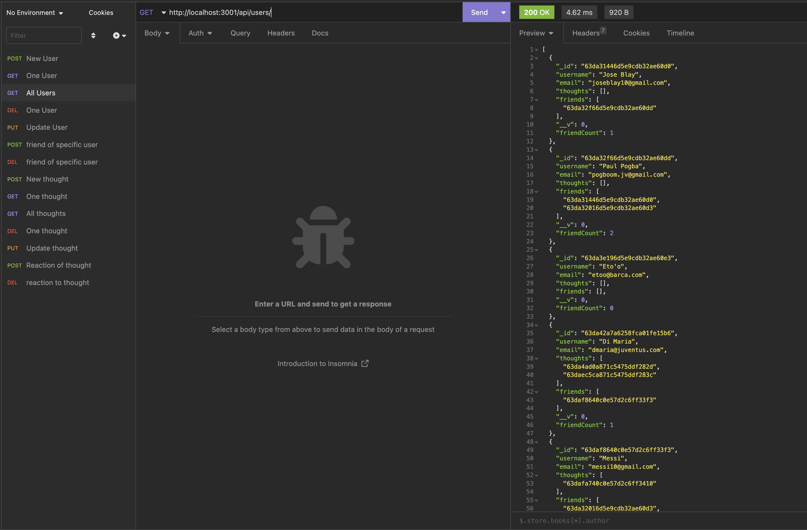
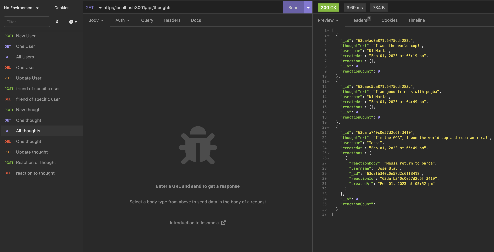
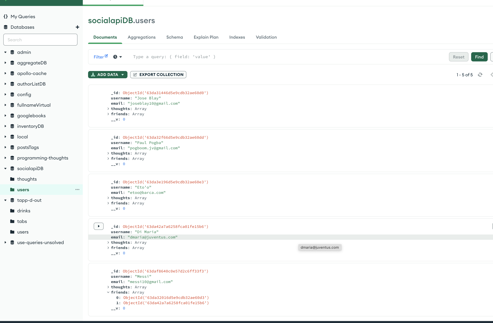
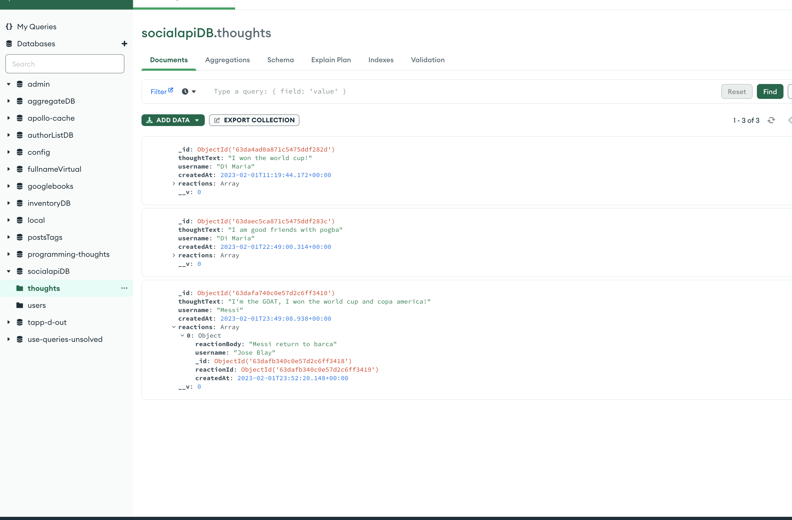

# API-Social

This is an API for a social network where users can express their thoughts, respond to the thoughts of friends, and build a friend list. It makes use of Moment.js for timestamp formatting, Express.js for routing, and a MongoDB database. Utilizing Insomnia, the seed data is generated.

[Demo Video](https://drive.google.com/file/d/1wd-77jMxkmRAE7TZ1Exh6IzoCqMCFshn/view)

## Table of Contents

- [Installation](#installation)
- [Usage and Testing](#usage-and-test)
- [Screenshots](#screenshots)
- [Contact me](#contact-me)

## Installation

```
npm i
```

## Usage and Test

**After the _npm_ has been installed** 

To initialize server:
```
npm start
```
or 

```
node server.js
```

Now listening http://localhost:3001

## Screenshots


##

##

##


## Contact Me
- Github: [JBlay10](https://github.com/JBlay10)
- Email: joseblay10@gmail.com


